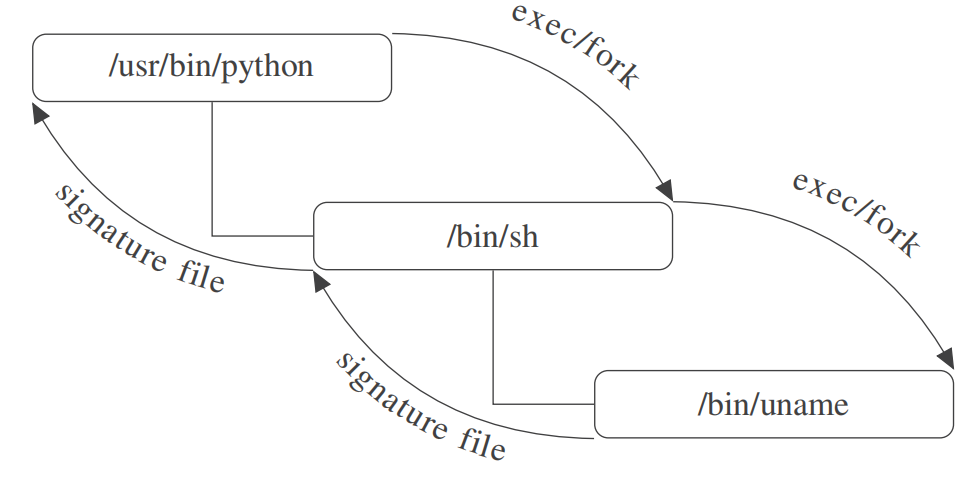

# SGXPy: Protecting Integrity of Python Applications with Intel SGX

Official implementation of "SGXPy: Protecting integrity of Python applications with Intel SGX" by Denghui Zhang, Guosai Wang, Wei Xu, Kevin Gao.

**Paper Link**: [https://ieeexplore.ieee.org/document/8945648](https://ieeexplore.ieee.org/document/8945648)

---

## Overview

Python is the programming language of choice for many data scientists, and thus widely used in cloud computing platforms. Untrusted cloud environments have imposed challenges to the security of Python applications. Intel SGX (Intel Software Guard Extensions) provides an encrypted enclave for securing applications, and a library OS technology can be adopted to run legacy applications inside these enclaves. However, this technology has some limitations:

1. It is difficult to ensure the integrity of Python applications as a result of the complex dependencies among modules.
2. Python applications often spawn new processes, and file access permissions need to be handled separately in the parent-child process.

To address these limitations, we present SGXPy (SGX Python), an integrity preserving tool for Python applications. The design of SGXPy makes it possible to obtain dependencies of applications and assign file access permissions among processes automatically:

1. During the build stage, SGXPy constructs dependency manifests of Python applications based on the ptrace mechanism.
2. To enhance access control among processes, SGXPy utilizes process introspection to cascade manifests for each process.

With the proposed framework, sophisticated Python applications such as NumPy and a web server can now run unmodified with the library OS. We present a series of experiments to evaluate performance overheads of Python applications in SGX. Our evaluation of NumPy submodules shows SGXPy can pass 97.60% of unit testing, even with the isolated environment and limited memory of SGX.

---

## SGXPYTHON

### Running Unmodified Applications on SGX with Encrypted Data and Program

### Submodules

- **linux-sgx-driver** 
  提取了 Linux 平台下的 SGX 驱动，本项目采用了最新的 sgx2 分支。

- **linux-sgx**  

  提供了 Linux 平台下的 SGX SDK 与 PSW 服务。

- **graphene**  

  轻量级开源内核，提供了一个支持多进程的可信计算 (SGX) 平台框架。 

  默认安装路径为 **~/sgxpython/graphene**。

---

### sgxpy

基于 **Graphene** 内核为 Python 脚本自动生成可信计算所需要的 manifest 文件（包括各种 .py 依赖文件与 .so文件），为运行 Python 脚本提供完整性支持。主要功能包括：

- 主脚本：**sgxpython.py**
- **pal-sgx-sign**：对 Python 与 manifest 文件进行签名
- **pal-sgx-get-token**：将签名文件发送到 aesmd 脚本生成 token 文件

---

### Install

安装脚本位于 setup 目录下，请按脚本所标识的顺序依次安装。  如需测试 SGXPy 对 NumPy 模块的支持：

- 请取消 **sgxpy/Makefile** 中 test 目标的注释
- 运行 **./script/nptestsuite.py**，测试用例的执行时间约为 30 分钟

---

## TODO

基于 Graphene 内核与 SGX 的 **Sealing** 或 **protected_fs** 功能，为存储于本地的数据文件与可执行文件提供机密性支持，让现有程序直接享用可信计算的便利。
